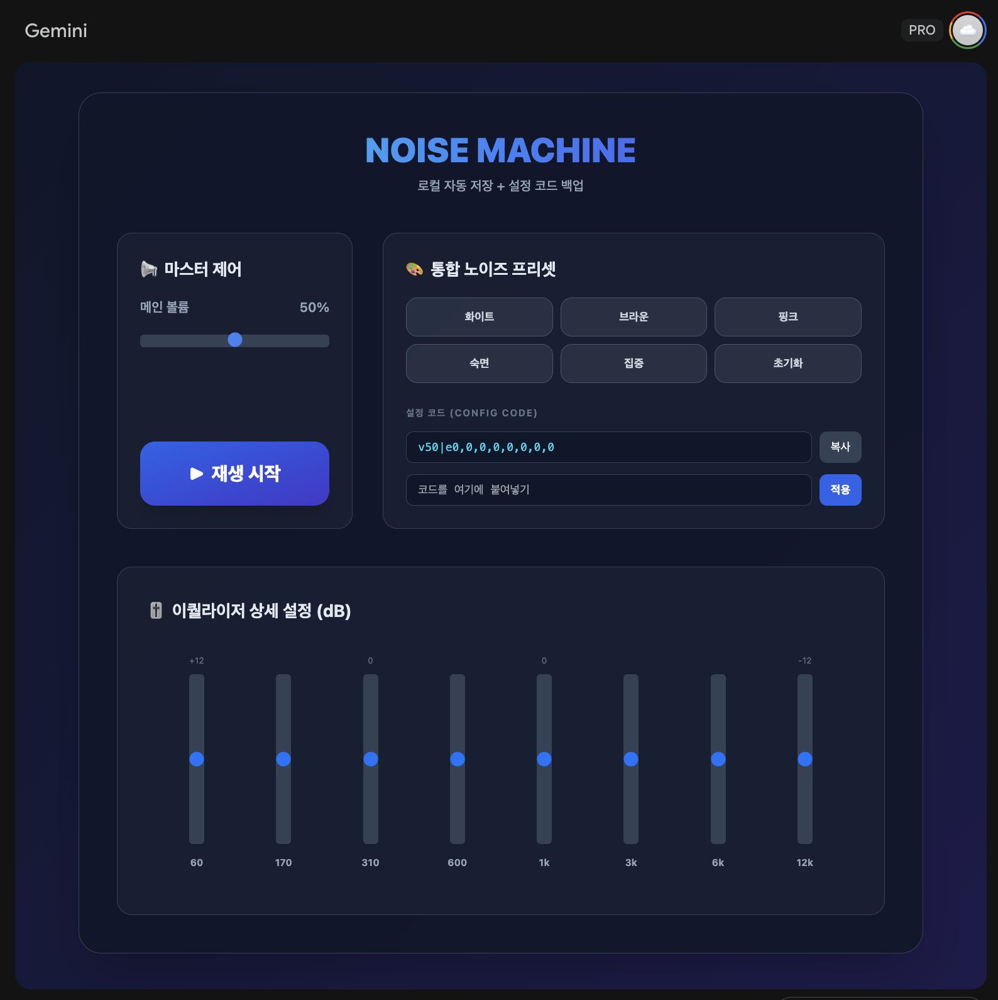
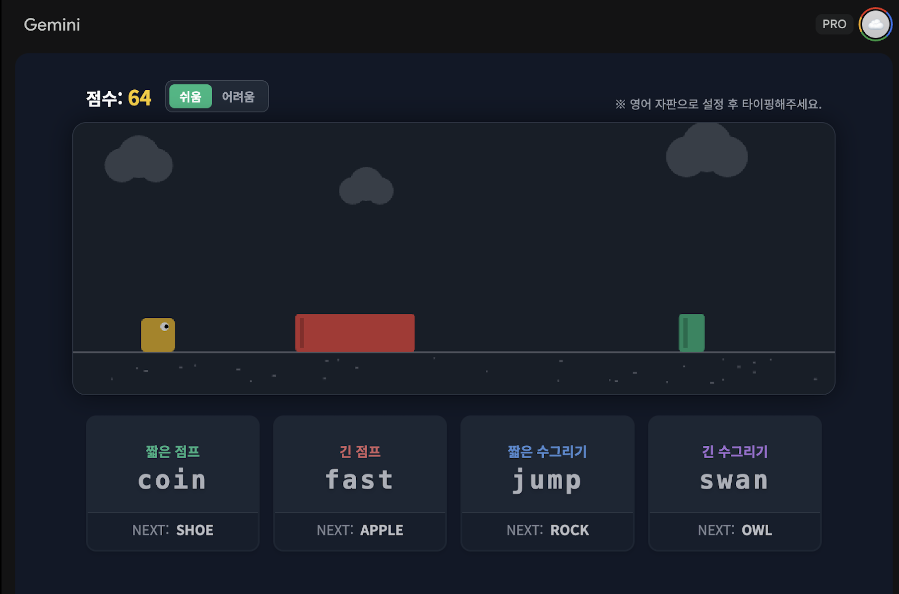
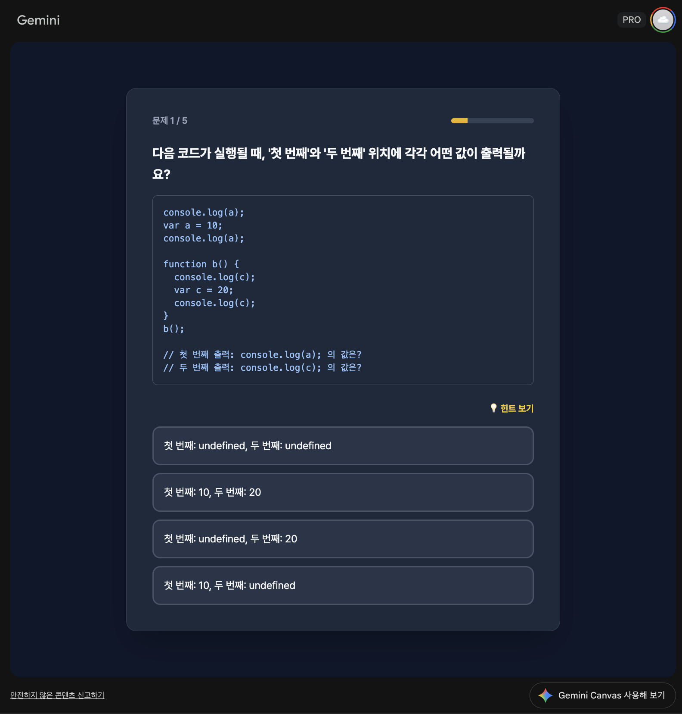
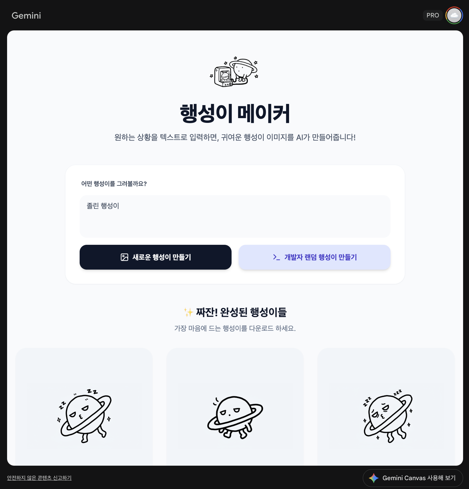

# gemini-canvas-mission

Gemini Canvas 미션 결과물을 관리하는 저장소입니다.

## 목적

- Gemini Canvas로 제작한 웹앱 결과물을 기록하고 공유합니다.
- 앱별 요구사항, 배포 링크, 회고를 일관된 형식으로 남깁니다.

<!-- --- -->

# 제출할 웹앱

## 앱 이름

🎧 노이즈 머신

## 카테고리

유틸리티 앱

### 배포 링크

[https://gemini.google.com/share/61095c8be85e](https://gemini.google.com/share/61095c8be85e)

### 이 앱을 만든 이유

- 어떤 문제/불편함을 해결하려고 했나요?
  - 원하는 화이트/브라운 노이즈 음원을 찾기 힘듬
  - 화이트/브라운 노이즈를 쉽게 공유하고 커스텀 할 수 없음
- 이 앱을 언제, 어떻게 사용할 건가요?
  - 집중을 위해 배경음으로 화이트 노이즈나 브라운 노이즈를 재생하고 싶을 때

### 주요 기능

- 노이즈 이퀄라이저
- 노이즈 프리셋 제공
- 로컬 스토리지에 커스텀 설정을 저장하고 가져오는 기능
- 커스컴 설정을 짧은 코드로 공유하는 기능

---

## 앱 이름

🏃 타이핑 런

## 카테고리

게임

### 배포 링크

[https://gemini.google.com/share/9d649bb0222c](https://gemini.google.com/share/9d649bb0222c)

### 이 앱을 만든 이유

- 어떤 문제/불편함을 해결하려고 했나요?
  - 상대적으로 덜 흥미로운 기존의 타자연습을 대체하기 위해
- 이 앱을 언제, 어떻게 사용할 건가요?
  - 새로운 배열의 키보드에 적응하기 위해

### 주요 기능

- 다가오는 장애물을 단어를 입력해 피하는 기능 (짧은 점프, 긴 점프, 짧은 수그리기, 긴 수그리기)
- 장애물에 가까워지면 시간이 느리게 가는 기능 (쉬움 난이도 한정)
- 난이도 조절 기능

---

## 앱 이름

❓ JS Master

## 카테고리

학습 앱

### 배포 링크

[https://gemini.google.com/share/4c3821732062](https://gemini.google.com/share/4c3821732062)

### 이 앱을 만든 이유

- 어떤 문제/불편함을 해결하려고 했나요?
  - 헷갈리기 쉬운 JavaScript 개념들을 퀴즈 형식으로 쉽게 학습하기 위해
- 이 앱을 언제, 어떻게 사용할 건가요?
  - 여유 시간이 생길 때 마다

### 주요 기능

- AI를 통해 혼동되기 쉬운 JavaScript 개념에 대한 문제 생성 기능
- 각 문제에 대한 힌트 제공 기능
- 틀린 문제를 다시 풀 수 있는 기능
- 난이도와 문제수를 조절 할 수 있는 기능

### AI 기능

- 어떤 AI 기능을 추가했나요?
  - AI로 퀴즈 문제를 생성하는 기능
- AI 기능이 앱에서 어떤 역할을 하나요?
  - 매 퀴즈 시작시 풀 문제를 AI로 생성하고 힌트를 제공하는 역할

---

## 앱 이름

🌎 행성이 메이커

## 카테고리

페어 프롬프트 릴레이

### 배포 링크

[https://gemini.google.com/share/ef4146fcd47a](https://gemini.google.com/share/ef4146fcd47a)

### 이 앱을 만든 이유

- 어떤 문제/불편함을 해결하려고 했나요?
  - 상황에 맞는 행성이 이미지를 찾을 수 없는 문제
- 이 앱을 언제, 어떻게 사용할 건가요?
  - 글이나 회고를 작성할때

### 주요 기능

- 사용자가 입력한 형태의 행성이 이미지를 3가지 생성하는 기능
- 생성된 이미지를 버튼을 눌러 다운로드 받을 수 있는 기능

### AI 기능 (해당되는 경우)

- 어떤 AI 기능을 추가했나요?
  - 이미지 모델로 사용자가 입력에 맞춰 이미지를 생성하는 기능
- AI 기능이 앱에서 어떤 역할을 하나요?
  - 사용자가 입력한 형태의 행성이를 생성하는 역할
